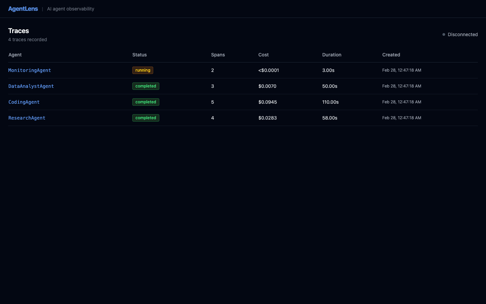
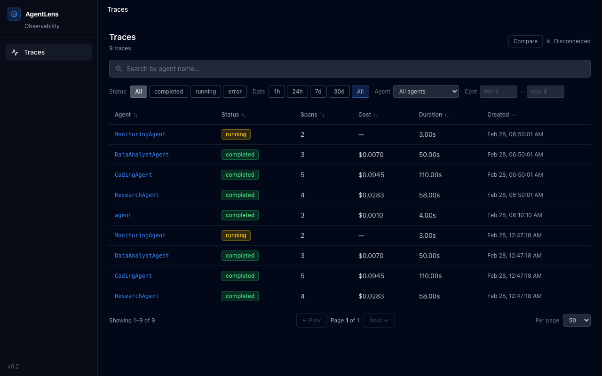
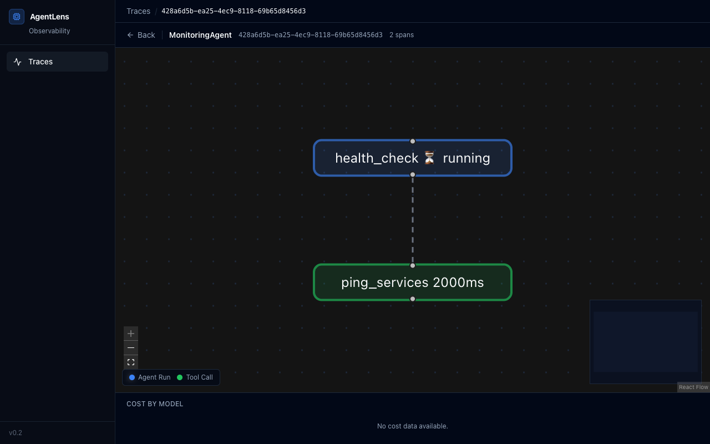
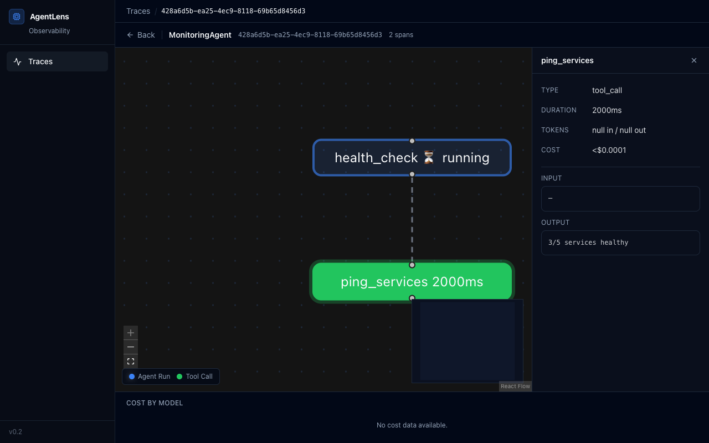

# AgentLens

**Debug AI agents visually** — self-hosted, open-source, agent-native observability.

> Unlike LangSmith (paid, cloud-only) and Langfuse (LLM-focused), AgentLens understands agents: tool calls, handoffs, memory reads, and decision trees — not just LLM generations.



<details>
<summary>Screenshots</summary>

### Trace List — search, filter, sort, and compare agent runs


### Agent Topology Graph — visualize tool calls, LLM calls, and handoffs


### Span Detail Panel — inspect any node with input/output, cost, and duration


</details>

## Features

- **Live trace streaming** — watch your agent think in real-time with incremental span updates
- **Agent topology graph** — visualize agent spawns, tool calls, and handoffs as an interactive DAG
- **Trace comparison** — side-by-side diff of two agent runs with color-coded span matching
- **Search & filters** — full-text search, status/agent/date/cost filters, sortable columns, pagination
- **Cost tracking** — 27 models priced (GPT-4.1, Claude 4, Gemini 2.0, DeepSeek, Llama 3.3)
- **Framework integrations** — LangChain, CrewAI, AutoGen, LlamaIndex, Google ADK
- **OpenTelemetry export** — bridge spans to any OTel-compatible backend
- **Batch transport** — configurable queue with auto-flush for high-throughput agents
- **Self-hosted** — `docker run` and done. Your data never leaves your machine.
- **90+ tests** — server + SDK with >82% coverage

## Quickstart

```bash
# 1. Start the dashboard
docker run -p 3000:3000 tranhoangtu/agentlens:0.2.0

# 2. Install the SDK
pip install agentlens-observe
```

```python
# 3. Instrument your agent
import agentlens

agentlens.configure(server_url="http://localhost:3000")

@agentlens.trace(name="ResearchAgent")
def run_agent(query: str) -> str:
    with agentlens.span("web_search", "tool_call") as s:
        result = search(query)
        s.set_output(result)
        s.set_cost("gpt-4o", input_tokens=500, output_tokens=200)
    return summarize(result)

run_agent("Latest AI research papers")
# → Traces stream to http://localhost:3000
```

## How It Works

```
Your Agent (Python)          AgentLens Server          Browser Dashboard
      │                            │                         │
      ├── @agentlens.trace ──────► POST /api/traces ───────► Live topology graph
      │   (fire-and-forget)        │                         │
      │   flush_span() ──────────► POST /api/traces/:id/spans► Real-time node updates
      │                            │                         │
      │                            ├── SSE stream ──────────► span_created events
      │                            │                         │
      └── Never blocked            └── SQLite + WAL          └── Cost breakdown + diff
```

## Framework Integrations

### LangChain / LangGraph

```python
from agentlens.integrations.langchain import AgentLensCallbackHandler

agent.run("task", callbacks=[AgentLensCallbackHandler()])
```

### CrewAI

```python
from agentlens.integrations.crewai import patch_crewai

patch_crewai()  # Auto-instruments all Crew runs
```

### AutoGen

```python
from agentlens.integrations.autogen import patch_autogen

patch_autogen()  # Patches ConversableAgent.generate_reply
```

### LlamaIndex

```python
from agentlens.integrations.llamaindex import AgentLensCallbackHandler
from llama_index.core import Settings
from llama_index.core.callbacks import CallbackManager

Settings.callback_manager = CallbackManager([AgentLensCallbackHandler()])
```

### Google ADK

```python
from agentlens.integrations.google_adk import patch_google_adk

patch_google_adk()  # Patches Agent.run and tool invocations
```

### OpenTelemetry Export

```python
from agentlens.exporters.otel import AgentLensOTelExporter
agentlens.add_exporter(AgentLensOTelExporter())
```

## Advanced Usage

### Batch Transport

```python
agentlens.configure(
    server_url="http://localhost:3000",
    batch_size=50,        # flush every 50 traces
    batch_interval=5.0,   # or every 5 seconds
)
```

### Custom Logging

```python
@agentlens.trace(name="MyAgent")
def run():
    agentlens.log("Starting research phase", phase="research")
    # logs appear in span.metadata["logs"]
```

## Development

```bash
# Dashboard (React + Vite)
cd dashboard && npm install && npm run dev

# Server (FastAPI)
cd server && python -m venv .venv && .venv/bin/pip install -r requirements.txt
.venv/bin/uvicorn main:app --reload --port 8000

# SDK
cd sdk && pip install -e ".[dev]"

# Tests
cd server && pytest tests/
cd sdk && pytest tests/
```

## Tech Stack

| Layer | Technology |
|-------|-----------|
| Dashboard | React 19, Vite 7, React Flow 12, Tailwind 3, Recharts 3, Radix UI |
| Server | Python FastAPI, SQLite (WAL mode), SSE |
| SDK | Python 3.10+, httpx, OTel bridge |
| Testing | pytest, httpx, respx (90+ tests, >82% coverage) |

## Roadmap

- [x] ~~Run diff (compare two agent executions)~~
- [x] ~~OpenTelemetry export~~
- [x] ~~Search, filters, pagination~~
- [x] ~~Framework integrations (AutoGen, LlamaIndex, Google ADK)~~
- [x] ~~Replay/time-travel debugging~~
- [ ] OpenTelemetry ingestion (receive OTel spans)
- [ ] PostgreSQL backend
- [ ] TypeScript SDK
- [ ] Alerting on agent behavior anomalies
- [ ] Multi-tenant auth

## License

MIT — see [LICENSE](LICENSE)
